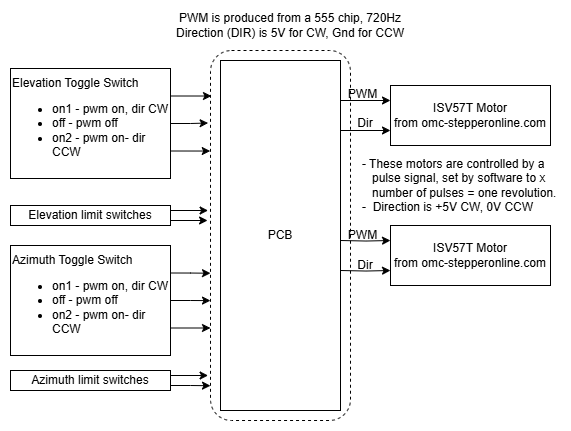

# Simple-Dish-Controller
Simple controller with toggle switches to move the motors of a satellite dish.

The project is to create a PCB that will control 2 motors tht will be used as the azimuth and elevation motors of a satellite dish. The direction will allow controlling simple movement for each motor, forward, reverse, still, all at one set speed.

The project uses Kicad to create the schematic, PCB and BOM.

This project fulfills 2 initiatives:
- Test out motor control
- Master Kicad for future projects
- Be the base for a follow up PCB that will use a Rashberry Pi to control the motors

## Project Overview

This diagram simply shows the function of the project: 

